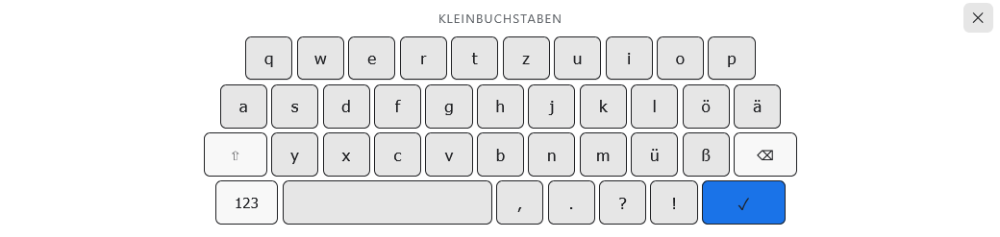
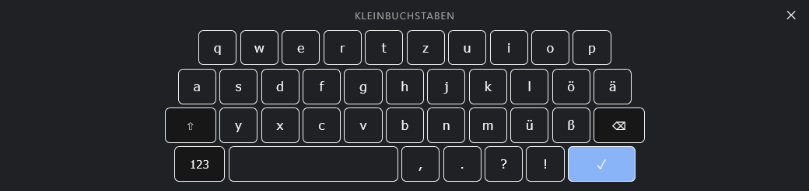

# Home Assistant OnScreen Keyboard - Lovelace Custom Card

A simple on-screen keyboard custom card for Home Assistant that automatically appears when clicking on text inputs. Works across Shadow DOM boundaries with Home Assistant's nested custom elements.

## Features

- Automatically opens when clicking/focusing on any input field on a dashboard
- Works with text, search, email, URL, password, number, and time input types
- Traverses Shadow DOM boundaries (composedPath) to detect inputs inside HA custom elements (ha-textfield, search-input, etc.)
- Supports German QWERTZ layout with lowercase (a-z), uppercase (A-Z), numbers (0-9)
- German special characters: ö, ä, ü, ß, Ö, Ä, Ü, ẞ, °
- Special characters: @, #, $, %, &, *, -, +, ~, `, =, /, \, |, (, ), [, ]
- Punctuation: , . ? ! : ; " '
- Shift toggle for uppercase (auto-releases after one letter, or stays locked with `sticky_shift`)
- Symbol/number mode toggle (123/ABC/abc)
- Customizable layouts: override the lowercase, uppercase, and/or symbols layouts directly from the card config (YAML)
- Close button (✕) to dismiss the keyboard without pressing Enter
- Backspace (works on number inputs via fallback logic)
- Space bar
- Enter key (dispatches Enter event and closes keyboard)
- Uses native value setter to properly trigger framework reactivity (floating labels, validation)
- Syncs value to parent HA custom elements and triggers Material layout updates

## Installation

### 1. Create the card file

Place the `onscreen-keyboard-card.js` file in your `www` folder inside your Home Assistant config directory:

```bash
config/
├── www/
│   └── onscreen-keyboard-card.js
```

To access the `www` folder:

1. In Home Assistant, go to **Settings** → **System** → **Backups**
2. Click **Storage** and navigate to **OS Media** → **config** → **www**
3. Or use the Samba add-on to access `\\YOUR_HA_IP\config\www\`

### 2. Register the resource in Lovelace

Go to **Settings** → **Dashboards** → Click the three dots on your dashboard → **Edit Dashboard** → **Resources** → **Add Resource**

Enter the URL:

```bash
/local/onscreen-keyboard-card.js
```

Set the type to **JavaScript URL**.

### 3. Add the card to your dashboard

In dashboard edit mode, add a **Manual** card (or **Vertical Stack** / **Horizontal Stack**) and configure it as:

```yaml
type: custom:onscreen-keyboard-card
```

Or in YAML mode:

```yaml
views:
  - title: Main
    cards:
      - type: custom:onscreen-keyboard-card
```

To override the keyboard layouts, see [Custom Layouts](#custom-layouts).

### 4. Refresh and test

- Refresh your browser (hard reload / clear cache)
- Click on any text input field on your dashboard
- The keyboard should appear at the bottom of the screen

## Keyboard Layouts

### Lowercase (default)

| Row | Keys |
| --- | ---- |
| 1 | q w e r t z u i o p |
| 2 | a s d f g h j k l ö ä |
| 3 | ⇧ y x c v b n m ü ß ⌫ |
| 4 | 123 [Space] , . ? ! ✓ |

### Uppercase (Shift active)

| Row | Keys |
| --- | ---- |
| 1 | Q W E R T Z U I O P |
| 2 | A S D F G H J K L Ö Ä |
| 3 | ⇧ Y X C V B N M Ü ẞ ⌫ |
| 4 | 123 [Space] , . ? ! ✓ |

### Symbols/Numbers (123 mode)

| Row | Keys |
| --- | ---- |
| 1 | 0 1 2 3 4 5 6 7 8 9 |
| 2 | @ # $ % & * - + ~ ` ° |
| 3 | ABC ß = / \ \| ( ) [ ] ⌫ |
| 4 | abc [Space] : ; " ' ✓ |

## Supported Input Types

| Type | Support |
| ---- | ------- |
| text | Full (selection-aware cursor) |
| search | Full |
| email | Full |
| url | Full |
| password | Full |
| number | Append/remove last char (no selection API) |
| time | Append/remove last char (no selection API) |
| textarea | Full (selection-aware cursor) |

## Special Keys

| Key | Display | Description |
| --- | ------- | ----------- |
| Shift | ⇧ | Toggle uppercase/lowercase |
| 123 | 123 | Switch to numbers & symbols |
| ABC / abc | ABC/abc | Switch back to letters |
| Backspace | ⌫ | Delete character before cursor (or last char for number inputs) |
| Space | [wide key] | Insert space |
| Enter | ✓ | Dispatch Enter event and close keyboard |

## Options

Configure these directly in the card YAML:

| Option | Type | Default | Description |
| ------ | ---- | ------- | ----------- |
| `layouts` | object | built-in | Override the `lowercase`, `uppercase`, and/or `symbols` layouts. See [Custom Layouts](#custom-layouts). |
| `labels` | object | language-based | Override the mode-indicator text shown above the keys (`lowercase`, `uppercase`, `symbols`). See [Mode Labels](#mode-labels). |
| `sticky_shift` | boolean | `false` | When `false`, Shift releases automatically after typing one letter (phone-style). Set to `true` to keep Shift active (caps-lock style) until tapped again. |

```yaml
type: custom:onscreen-keyboard-card
sticky_shift: true
```

A ✕ close button is shown in the keyboard header so the keyboard can be dismissed without pressing Enter.

## Mode Labels

The keyboard shows a small indicator above the keys describing the current mode. By default the text follows your Home Assistant language:

| Mode | English | German (`de`) |
| ---- | ------- | ------------- |
| `lowercase` | Lowercase | Kleinbuchstaben |
| `uppercase` | Uppercase | Großbuchstaben |
| `symbols` | Symbols | Symbole |

If your language is not built in, English is used. You can override any of the three labels with the `labels` option (overrides take priority over the language defaults):

```yaml
type: custom:onscreen-keyboard-card
labels:
  lowercase: abc
  uppercase: ABC
  symbols: "123 / #"
```

Omit any mode to keep its language-based default.

## Custom Layouts

You can override the built-in keyboard layouts directly from the card configuration — no need to edit the JavaScript file. Provide a `layouts` option with any of the three modes: `lowercase`, `uppercase`, and `symbols`. Any mode you omit keeps its default layout.

Each layout is a list of rows, and each row is a list of keys. Most keys are inserted literally (the exact string you type). The following keys are **special** and trigger built-in behavior instead of being typed:

| Key string | Behavior |
| ---------- | -------- |
| `Shift` | Toggle uppercase/lowercase (shown as ⇧) |
| `123` | Switch to the symbols layout |
| `ABC` / `abc` | Switch back to the letters layout |
| `⌫` | Backspace |
| ` ` (a single space) | Space bar |
| `Enter` | Confirm and close the keyboard (shown as ✓) |

### Example: override a single mode

This keeps the default uppercase and symbols layouts and only replaces the lowercase layout:

```yaml
type: custom:onscreen-keyboard-card
layouts:
  lowercase:
    - ["q", "w", "e", "r", "t", "y", "u", "i", "o", "p"]
    - ["a", "s", "d", "f", "g", "h", "j", "k", "l"]
    - ["Shift", "z", "x", "c", "v", "b", "n", "m", "⌫"]
    - ["123", " ", ".", "Enter"]
```

### Example: override all three modes

```yaml
type: custom:onscreen-keyboard-card
layouts:
  lowercase:
    - ["q", "w", "e", "r", "t", "y", "u", "i", "o", "p"]
    - ["a", "s", "d", "f", "g", "h", "j", "k", "l"]
    - ["Shift", "z", "x", "c", "v", "b", "n", "m", "⌫"]
    - ["123", " ", ",", ".", "Enter"]
  uppercase:
    - ["Q", "W", "E", "R", "T", "Y", "U", "I", "O", "P"]
    - ["A", "S", "D", "F", "G", "H", "J", "K", "L"]
    - ["Shift", "Z", "X", "C", "V", "B", "N", "M", "⌫"]
    - ["123", " ", ",", ".", "Enter"]
  symbols:
    - ["1", "2", "3", "4", "5", "6", "7", "8", "9", "0"]
    - ["@", "#", "$", "_", "&", "-", "+", "(", ")", "/"]
    - ["ABC", "*", "\"", "'", ":", ";", "!", "?", "⌫"]
    - ["abc", " ", ".", ",", "Enter"]
```

> Notes
>
> - Include at least one `⌫` and one `Enter` key (and a `Shift` / `123` / `ABC` key if you want mode switching), otherwise users won't be able to access those actions.
> - Invalid layouts (not a list of rows of string keys) are ignored, and the default for that mode is used instead. A warning is logged to the browser console.
> - In YAML, write a literal space `" "` for the space bar.

## Visual Editor

The card provides a basic visual editor in the dashboard UI. When you add or edit the card without YAML mode, you get a **Sticky Shift** toggle. Advanced options (`layouts`, `labels`) remain YAML-only.

## Theming

The keyboard automatically adapts to your active Home Assistant theme. It reads standard theme variables (with sensible dark-mode fallbacks):

| Variable | Used for |
| -------- | -------- |
| `--card-background-color` / `--ha-card-background` | Keyboard background |
| `--secondary-background-color` | Key background |
| `--divider-color` | Key hover background |
| `--primary-text-color` | Key text |
| `--primary-text-color` | Key border |
| `--primary-color` | Accent keys (Enter, active toggles) |
| `--secondary-text-color` | Mode indicator text |

If no theme variables are present, the original dark styling is used.

### Examples

**Home Assistant Light Theme**


**Home Assistant Dark Theme**


**Google Dark Theme**


## Accessibility

- The keyboard is exposed as a labelled `role="group"` with a `lang` hint based on your Home Assistant language.
- Every key is a real `<button>` with an `aria-label` (special keys are described, e.g. Backspace, Enter, Space), localized for English and German.

## Customization

You can modify the CSS in the `render()` method of `onscreen-keyboard-card.js` to change:

- Colors (background, button colors)
- Button sizes
- Position on screen
- Font styles

## Technical Details

- Built with Vanilla JavaScript and Web Components (Shadow DOM)
- No build tools or dependencies required
- Uses `composedPath()` and capturing event listeners to detect focus across nested Shadow DOMs
- Uses native `HTMLInputElement.prototype.value` setter to bypass framework property interceptors
- Dispatches proper `InputEvent` with `inputType` for framework compatibility
- Syncs value to parent custom elements and calls `.layout()` for Material floating labels
- Gracefully handles number/time inputs that don't support the Selection API
- Adapts to the active Home Assistant theme via CSS custom properties
- Shows only a single keyboard even when multiple cards are placed on a dashboard

## Development

To modify the keyboard, edit `onscreen-keyboard-card.js` and reload Home Assistant. Clear your browser cache to ensure the updated file is loaded.

## Contributing

Contributions are welcome! This project lives at [freequenzart/onscreen-keyboard-card](https://github.com/freequenzart/onscreen-keyboard-card).

- **Found a bug or have an idea?** Open an [issue](https://github.com/freequenzart/onscreen-keyboard-card/issues).
- **Want to contribute code?**
  1. [Fork the repository](https://github.com/freequenzart/onscreen-keyboard-card/fork).
  2. Create a feature branch (`git checkout -b my-feature`).
  3. Make your changes and test them in a Home Assistant dashboard.
  4. Commit and push your branch, then open a [pull request](https://github.com/freequenzart/onscreen-keyboard-card/pulls).
- **Spread the word:** ⭐ star the repo if you find it useful.

Please keep pull requests focused and describe what you changed and why.
